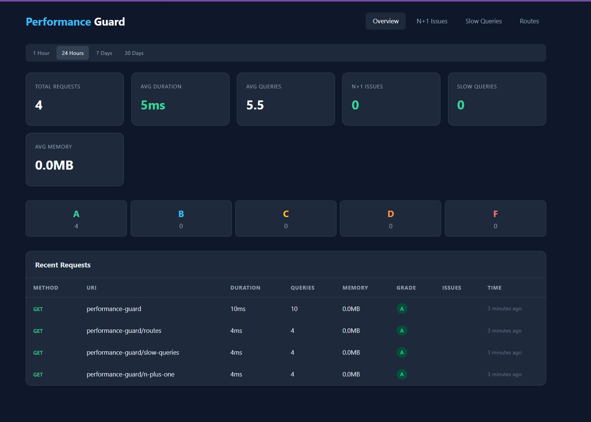
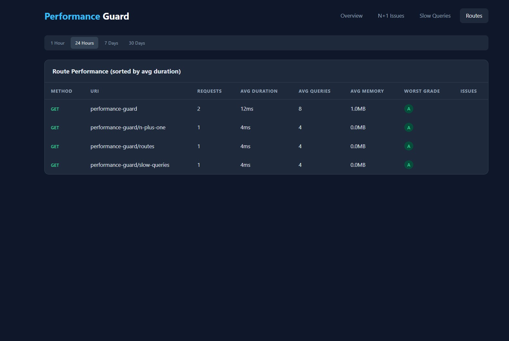

<p align="center">
  <h1 align="center">Laravel Performance Guard</h1>
  <p align="center">Production-safe performance monitoring for Laravel. Catch N+1 queries, slow queries, and performance issues before your users do.</p>
</p>

<p align="center">
  <a href="https://github.com/zooster90/laravel-performance-guard/actions/workflows/tests.yml"></a>
  <a href="https://packagist.org/packages/zufarmarwah/laravel-performance-guard"></a>
  <a href="https://packagist.org/packages/zufarmarwah/laravel-performance-guard"></a>
  <a href="https://packagist.org/packages/zufarmarwah/laravel-performance-guard"></a>
  <a href="LICENSE"></a>
</p>

---

## Why Performance Guard?

Most performance issues in Laravel apps go unnoticed until users complain. N+1 queries silently multiply, slow queries stack up, and memory usage creeps higher with every deployment.

**Performance Guard** sits in your middleware stack, monitors every request, and gives you a clear picture of what's happening -- with zero changes to your application code.

- **Drop-in middleware** -- no code changes required in your controllers or models
- **Production-safe** -- configurable sampling, async storage, and instant kill switch
- **Actionable insights** -- tells you *which* relationship to eager load, not just "you have duplicates"
- **Privacy-first** -- automatically redacts passwords, tokens, and sensitive data from recorded queries

## Features

- **N+1 Query Detection** -- detects duplicate query patterns and suggests eager loading fixes
- **Slow Query Monitoring** -- identifies slow queries with optimization suggestions
- **Performance Grading** -- grades every request A-F based on response time
- **Built-in Dashboard** -- dark-themed dashboard to visualize performance metrics
- **Notifications** -- alerts via Slack, Email, or Telegram when issues are detected
- **Queue Support** -- stores metrics asynchronously to avoid impacting request performance
- **Privacy First** -- automatically redacts sensitive data from recorded queries
- **Sampling** -- configurable sampling rate for high-traffic production environments
- **Auto Cleanup** -- artisan command to purge old records with configurable retention
- **High Memory Detection** -- alerts when requests exceed memory thresholds
- **Route Aggregation** -- per-route performance breakdown to find your slowest endpoints
- **Trend Comparison** -- period-over-period comparison showing improvement or regression
- **Artisan Status Command** -- quick terminal overview of performance health
- **Octane Compatible** -- safe for long-running processes with proper state isolation

## Screenshots

### Dashboard Overview

Stats cards with trend indicators, grade distribution, and recent requests table.



### Route Performance

Per-route aggregation showing avg duration, queries, memory, and worst grade.



## Requirements

- PHP 8.1+
- Laravel 10, 11, or 12

### Database Compatibility

Works with any database supported by Laravel:

| Database | Status |
|----------|--------|
| MySQL / MariaDB | Fully tested |
| PostgreSQL | Fully compatible |
| SQLite | Fully compatible (used in test suite) |
| SQL Server | Compatible via query builder |

## Installation

> **Note:** The Composer package name is `zufarmarwah/laravel-performance-guard`.

```bash
composer require zufarmarwah/laravel-performance-guard
```

Then run the install command (publishes config + runs migrations in one step):

```bash
php artisan performance-guard:install
```

<details>
<summary>Or install manually</summary>

```bash
php artisan vendor:publish --tag=performance-guard-config
php artisan migrate
```

</details>

## Quick Start

### Laravel 11+ (bootstrap/app.php)

To monitor **all web requests**, append the middleware globally:

```php
->withMiddleware(function (Middleware $middleware) {
    $middleware->appendToGroup('web', \Zufarmarwah\PerformanceGuard\Middleware\PerformanceMonitoringMiddleware::class);
})
```

Or apply it to **specific routes** only:

```php
Route::middleware(['performance-guard'])->group(function () {
    Route::get('/users', [UserController::class, 'index']);
    Route::get('/posts', [PostController::class, 'index']);
});
```

### Laravel 10 (app/Http/Kernel.php)

Add to a middleware group or use the alias on specific routes:

```php
// In Kernel.php -- monitor all web requests
protected $middlewareGroups = [
    'web' => [
        // ...existing middleware
        \Zufarmarwah\PerformanceGuard\Middleware\PerformanceMonitoringMiddleware::class,
    ],
];
```

```php
// Or on specific routes
Route::middleware(['performance-guard'])->group(function () {
    // your routes
});
```

Visit `/performance-guard` in your browser. That's it.

> **Tip:** By default, data is stored synchronously so you see results immediately. For production, set `PERFORMANCE_GUARD_ASYNC=true` in your `.env` to store via queue.

## Configuration

After publishing, edit `config/performance-guard.php`:

```php
return [
    // Toggle monitoring on/off
    'enabled' => env('PERFORMANCE_GUARD_ENABLED', true),

    // Monitor a percentage of requests (0.0 to 1.0)
    'sampling_rate' => env('PERFORMANCE_GUARD_SAMPLING_RATE', 1.0),

    'thresholds' => [
        'n_plus_one' => 10,        // Duplicate queries to trigger N+1 alert
        'slow_query_ms' => 300,    // Query duration threshold (ms)
        'slow_request_ms' => 1000, // Request duration threshold (ms)
        'memory_mb' => 128,        // Memory usage threshold (MB)
        'query_count' => 50,       // Total query count warning
    ],

    // Performance grading scale (duration in ms)
    'grading' => [
        'A' => 200,   // <= 200ms
        'B' => 500,   // <= 500ms
        'C' => 1000,  // <= 1000ms
        'D' => 3000,  // <= 3000ms
        // Everything above = F
    ],
];
```

See the [full config file](config/performance-guard.php) for all options including dashboard, notifications, storage, and privacy settings.

## Dashboard

The built-in dashboard is available at `/performance-guard` and includes four views:

| View | What it shows |
|------|--------------|
| **Overview** | Total requests, avg duration, query counts, memory, grades with trend indicators |
| **N+1 Issues** | All requests where duplicate query patterns were detected |
| **Slow Queries** | All requests containing slow database queries |
| **Routes** | Per-route aggregation: avg duration, avg queries, memory, worst grade |

Period filtering is available for 1 hour, 24 hours, 7 days, or 30 days.

### Dashboard Access Control

By default, the dashboard requires authorization. Define the gate in your `AuthServiceProvider`:

```php
use Illuminate\Support\Facades\Gate;

Gate::define('viewPerformanceGuard', function ($user) {
    return in_array($user->email, [
        'admin@example.com',
    ]);
});
```

You can also restrict by IP or email whitelist:

```php
'dashboard' => [
    'auth' => true,
    'allowed_ips' => ['127.0.0.1', '10.0.0.1'],
    'allowed_emails' => ['admin@example.com'],
],
```

Set `auth` to `false` for open access (not recommended in production).

## API Endpoints

All dashboard data is available as JSON:

| Endpoint | Description |
|----------|-------------|
| `GET /performance-guard/api` | Overview stats with grade distribution |
| `GET /performance-guard/api/{uuid}` | Single record with all recorded queries |
| `GET /performance-guard/n-plus-one` | N+1 issues (paginated) |
| `GET /performance-guard/slow-queries` | Slow query records (paginated) |
| `GET /performance-guard/routes` | Route-level aggregated stats (paginated) |

All endpoints accept a `?period=` parameter (`1h`, `24h`, `7d`, `30d`).

## Notifications

Get alerted when performance issues occur.

### Slack

```env
PERFORMANCE_GUARD_NOTIFICATIONS=true
PERFORMANCE_GUARD_SLACK_WEBHOOK=https://hooks.slack.com/services/...
```

### Telegram

```env
PERFORMANCE_GUARD_NOTIFICATIONS=true
PERFORMANCE_GUARD_TELEGRAM_TOKEN=123456:ABC-DEF...
PERFORMANCE_GUARD_TELEGRAM_CHAT_ID=-1001234567890
```

To get your bot token, message [@BotFather](https://t.me/BotFather). To get your chat ID, add the bot to a group and check `https://api.telegram.org/bot<TOKEN>/getUpdates`.

### Email

```php
'notifications' => [
    'enabled' => true,
    'channels' => [
        'email' => [
            'enabled' => true,
            'recipients' => ['ops@yourcompany.com'],
        ],
    ],
],
```

### Alert Types

| Alert | Trigger |
|-------|---------|
| N+1 Queries | Duplicate query pattern detected |
| Slow Queries | Query exceeds duration threshold |
| Slow Request | Request exceeds duration threshold |
| High Memory | Memory usage exceeds threshold |
| Grade F | Request received the lowest grade |

A cooldown period (default: 15 minutes) prevents alert spam for the same issue.

## Artisan Commands

### Status

Get a performance overview in your terminal:

```bash
php artisan performance-guard:status

# Different time periods
php artisan performance-guard:status --period=1h
php artisan performance-guard:status --period=7d
php artisan performance-guard:status --period=30d
```

Shows requests, avg duration, queries, memory, N+1 count, grade distribution, and the 5 slowest routes -- all with trend indicators.

### Cleanup

Remove old records to keep your database lean:

```bash
# Use configured retention (default: 30 days)
php artisan performance-guard:cleanup

# Custom retention
php artisan performance-guard:cleanup --days=7

# Skip confirmation
php artisan performance-guard:cleanup --force
```

### Scheduling Cleanup

**Laravel 11+ (bootstrap/app.php):**

```php
->withSchedule(function (\Illuminate\Console\Scheduling\Schedule $schedule) {
    $schedule->command('performance-guard:cleanup --force')->daily();
})
```

**Laravel 10 (app/Console/Kernel.php):**

```php
$schedule->command('performance-guard:cleanup --force')->daily();
```

## Production Deployment

Recommended `.env` settings:

```env
PERFORMANCE_GUARD_ENABLED=true
PERFORMANCE_GUARD_SAMPLING_RATE=0.1
PERFORMANCE_GUARD_ASYNC=true
PERFORMANCE_GUARD_QUEUE=performance
PERFORMANCE_GUARD_RETENTION_DAYS=14
```

| Setting | Value | Why |
|---------|-------|-----|
| `SAMPLING_RATE` | `0.1` | Monitor 10% of requests -- reduces overhead while catching patterns |
| `ASYNC` | `true` | Recording never blocks the HTTP response |
| `QUEUE` | `performance` | Dedicated queue prevents competition with business jobs |
| `RETENTION_DAYS` | `14` | Keeps database size manageable |

### Emergency Kill Switch

Disable instantly without a deploy:

```env
PERFORMANCE_GUARD_ENABLED=false
```

Or at runtime:

```php
use Zufarmarwah\PerformanceGuard\Facades\PerformanceGuard;

PerformanceGuard::disable();
```

## Facade

```php
use Zufarmarwah\PerformanceGuard\Facades\PerformanceGuard;

// Get stats for a period
$stats = PerformanceGuard::getStats('24h');

// Get grade distribution
$grades = PerformanceGuard::getGradeDistribution('7d');

// Toggle monitoring
PerformanceGuard::enable();
PerformanceGuard::disable();

// Check status
if (PerformanceGuard::isEnabled()) {
    // ...
}
```

## How It Works

```
Request --> Middleware --> QueryListener (DB::listen)
                              |
                        Response sent
                              |
                  NPlusOneAnalyzer (detects duplicates)
                  SlowQueryAnalyzer (finds slow queries)
                  PerformanceScorer (grades A-F)
                              |
                  StorePerformanceRecordJob (queued)
                              |
                  NotificationDispatcher (if configured)
```

1. The `performance-guard` middleware wraps each request
2. A `QueryListener` captures every SQL query via `DB::listen()`
3. After the response, analyzers process the captured data
4. Results are stored asynchronously via a queued job
5. Notifications are dispatched if thresholds are exceeded
6. Sensitive data is automatically redacted before storage

## Octane Support

Performance Guard is compatible with Laravel Octane. The `QueryListener` state is properly reset between requests to prevent data leaking across long-lived worker processes.

## Testing

```bash
composer test
```

## Contributing

Contributions are welcome! Please:

1. Fork the repository
2. Create a feature branch (`git checkout -b feature/your-feature`)
3. Write tests for your changes
4. Ensure all tests pass (`composer test`)
5. Submit a pull request

## License

MIT License. See [LICENSE](LICENSE) for details.
